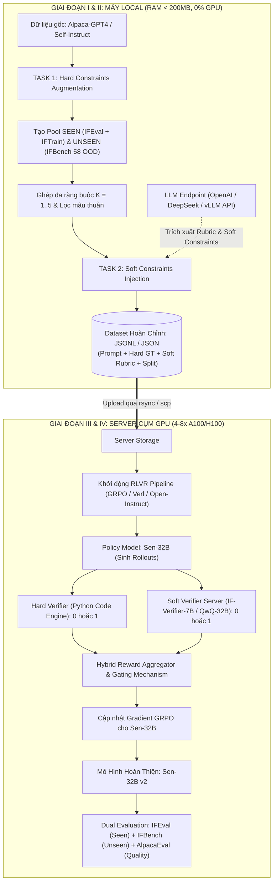

# Bản Thiết Kế Kiến Trúc Toàn Diện: Pipeline Nâng Cấp Năng Lực Instruction Following (Sen-32B v2)

> **Tài liệu phương pháp luận nền tảng:**
> 1. *Generalizing Verifiable Instruction Following* (AI2 & UW, NeurIPS 2025 - IFBench / IF-RLVR)
> 2. *VerIF: Verification Engineering for Reinforcement Learning in Instruction Following* (Tsinghua University, EMNLP 2025)
> 3. *Instruction Following Evaluation for Large Language Models* (Google Research - IFEval)

---

## I. Tổng Quan Mục Tiêu & Hai Bài Toán Cốt Lõi

Mục tiêu của dự án là nâng cấp mô hình **Sen-32B (phiên bản 2nd)** từ mô hình nền tảng 32B (như Qwen2.5-32B) thông qua kỹ thuật **SFT $\rightarrow$ RLVR (GRPO)**, khắc phục triệt để 2 điểm yếu chí mạng của phiên bản 1st:

```
[Hạn Chế v1]                                          [Giải Pháp v2]
1. Overfit 25 luật cứng của IFEval            ──►   Task 1: Generalization với Unseen Constraints (IFBench)
2. Reward Hacking (Hy sinh nội dung gốc để    ──►   Task 2: Cân bằng Ngữ nghĩa & Quy tắc qua Soft Constraints (VerIF)
   nhồi nhét quy tắc, trả lời cộc lốc/rác)
```

---

## II. Sơ Đồ Kiến Trúc Luồng Xử Lý Toàn Diện (End-to-End Flowchart)

Hệ thống được chia tách rạch ròi thành 2 môi trường: **Môi trường Local (Không tốn GPU/RAM)** và **Môi trường Server GPU (Huấn luyện & Đánh giá)**.



---

## III. Chi Tiết Giai Đoạn 1: Xây Dựng Hard Constraints (Đã Hoàn Thành Ở Task 1)

1. **Khái niệm Hard Constraints:**
   * Các quy tắc bề mặt có thể xác minh khách quan bằng mã nguồn Python 100% (Đếm từ, đếm câu, đoạn văn, từ khóa cấm, chữ cái, JSON, XML, Quotation, Không dấu phẩy...).
2. **Nguyên lý Generalization:**
   * **Phân chia Split:** Tách rạch ròi `"constraint_split": "seen"` (cho tập train) và `"constraint_split": "unseen"` (cho tập test OOD 58 constraints của IFBench).
   * **Multi-Constraint:** Ghép $K \in [1, 5]$ ràng buộc cùng lúc để mô hình hình thành danh sách kiểm tra nội tại (*Internal Checklist*).
   * **Khử xung đột:** Ma trận `Compatibility Engine` ngăn chặn các prompt mâu thuẫn logic.

---

## IV. Chi Tiết Giai Đoạn 2: Bổ Sung Soft Constraints (Trọng Tâm Task 2)

### 1. Khái niệm Soft Constraints
* Là các ràng buộc ngữ nghĩa mang tính định tính, bắt buộc phải hiểu ngữ cảnh và bản chất vấn đề để đánh giá.
* Gồm 4 nhóm chính:
  * **Semantic Completeness (Tính đầy đủ nội dung):** Yêu cầu giải thích rõ cơ chế, nguyên nhân, hệ quả, không bỏ qua các khía cạnh cốt lõi của câu hỏi gốc.
  * **Tone & Persona (Văn phong):** Giữ phong cách học thuật, trung lập, khách quan; không dùng tiếng lóng, không dùng đại từ nhân xưng cảm tính.
  * **Reasoning Structure (Cấu trúc lập luận):** Lập luận theo từng bước, so sánh đa chiều, kèm ví dụ minh họa thực tế.
  * **Negative Semantic (Phủ định ngữ nghĩa):** Không đề cập đến một hướng giải pháp nhất định (ví dụ: *"không dùng giải pháp công nghệ, chỉ dùng giải pháp kinh tế"*).

### 2. Cơ chế sinh Soft Constraints qua LLM Endpoint (Tiết kiệm tài nguyên Local)
* Máy local chỉ gửi câu hỏi gốc `(instruction)` qua một **LLM Endpoint** (gọi API GPT-4o-mini / DeepSeek-V3 / QwQ-32B hoặc server vLLM nội bộ).
* **Prompt gửi tới LLM Endpoint:**
  ```text
  Cho câu hỏi sau: "{base_instruction}"
  Nhiệm vụ: Hãy tạo ra:
  1. Một yêu cầu ngữ nghĩa/văn phong tự nhiên (Soft Constraint) bổ trợ cho câu hỏi này.
  2. Một tiêu chí chấm điểm nhị phân (Eval Rubric) để sau này LLM Judge đọc và trả về 1 nếu đạt, 0 nếu không đạt.
  Trả về dạng JSON: {"description": "...", "eval_rubric": "..."}
  ```
* **Tài nguyên tiêu thụ trên máy local:**
  * RAM: $< 200\text{MB}$ (chỉ lưu trữ stream JSON buffer).
  * CPU: $< 5\%$ (chỉ chạy kết nối mạng HTTPS I/O).
  * GPU: $0\%$ (hoàn toàn không cần GPU local).

### 3. Cấu trúc Format Dữ Liệu Đầu Ra Cuối Cùng (Task 1 + Task 2)
Mỗi dòng trong file JSONL / JSON sẽ chứa đầy đủ cả 2 nhánh kiểm tra:

```json
{
  "key": "sen_hybrid_0001",
  "dataset_source": "vicgalle/alpaca-gpt4",
  "constraint_split": "seen",
  "base_instruction": "Câu hỏi gốc ban đầu...",
  "prompt": "Câu hỏi gốc + [Quy tắc Hard] + [Quy tắc Soft]...",
  
  "num_constraints": {
    "total": 4,
    "hard_count": 2,
    "soft_count": 2
  },

  "hard_constraints": {
    "constraint_ids": ["length_constraints:number_words", "punctuation:no_comma"],
    "constraints_description": ["...", "..."],
    "ground_truth": [
      {
        "instruction_id": ["length_constraints:number_words", "punctuation:no_comma"],
        "kwargs": [{"num_words": 150, "relation": "less than"}, {}]
      }
    ]
  },

  "soft_constraints": {
    "constraints": [
      {
        "id": "semantic:depth_mechanism",
        "description": "Nêu rõ nguyên nhân cốt lõi và ít nhất 2 giải pháp...",
        "eval_rubric": "Phản hồi có phân tích nguyên nhân và đưa đủ 2 giải pháp khả thi không? Trả về 1 nếu đạt, 0 nếu thiếu."
      },
      {
        "id": "tone:academic_objective",
        "description": "Duy trì văn phong học thuật, không dùng từ ngữ cảm tính...",
        "eval_rubric": "Phản hồi có giữ văn phong khách quan không? Trả về 1 nếu đạt, 0 nếu có từ cảm tính."
      }
    ]
  },

  "reward_spec": {
    "w_hard": 0.5,
    "w_soft": 0.5,
    "gating": true
  },

  "messages": [
    {
      "role": "user",
      "content": "..."
    }
  ]
}
```

---

## V. Chi Tiết Giai Đoạn 3: Huấn Luyện RLVR / GRPO Trên Server GPU

*(Giai đoạn này thực hiện khi đã chuyển file dataset từ máy local lên máy chủ GPU).*

### 1. Kiến Trúc Server GPU (Phân Bổ Tài Nguyên)
* **Node huấn luyện chính (Policy Training):**
  * Chạy thuật toán **GRPO (Group Relative Policy Optimization)** với mô hình **Sen-32B**.
  * Framework đề xuất: **`verl`** (nền tảng của bài báo VerIF) hoặc **`open-instruct`** (nền tảng của bài báo IFBench).
  * Yêu cầu phần cứng: Cụm 4 hoặc 8 GPU H100/A100 (80GB VRAM) có kết nối NVLink.
* **Node phụ trợ (Reward Server - Online Verifiers):**
  * Chạy song song 1 model Verifier nhẹ: **`THU-KEG/IF-Verifier-7B`** (chỉ cần 1 GPU 24GB như RTX 3090/4090 hoặc 1 GPU A100 cắt nhỏ) dùng vLLM để phản hồi chấm điểm siêu tốc.

### 2. Thuật Toán Tính Thưởng Lai (Hybrid Reward with Gating Mechanism)
Trong mỗi bước Rollout của GRPO:
1. Mô hình Sen-32B sinh ra một tập $G$ câu trả lời (ví dụ $G = 8$ responses cho mỗi prompt).
2. **Nhánh 1 (Hard Verifier - CPU):** Chạy hàm Python kiểm tra độ dài, từ khóa, định dạng $\rightarrow$ trả về điểm số $R_{\text{hard}} \in [0, 1]$.
3. **Nhánh 2 (Soft Verifier - GPU):** Gửi phản hồi sang `IF-Verifier-7B` kèm theo `eval_rubric` $\rightarrow$ trả về điểm số $R_{\text{soft}} \in [0, 1]$.
4. **Cơ chế Gating chống Reward Hacking (Triệt tiêu gian lận):**
   $$R_{\text{total}} = \begin{cases} 
   0.5 \cdot R_{\text{hard}} + 0.5 \cdot R_{\text{soft}} & \text{nếu } R_{\text{soft}} \ge 0.5 \text{ (Trả lời đúng trọng tâm câu hỏi gốc)} \\
   0.0 & \text{nếu } R_{\text{soft}} < 0.5 \text{ (Lạc đề hoặc viết nhảm nhí để ăn gian luật)}
   \end{cases}$$
5. Thuật toán GRPO tính toán Advantage dựa trên $R_{\text{total}}$ và cập nhật trọng số cho Sen-32B.

---

## VI. Chi Tiết Giai Đoạn 4: Đánh Giá Toàn Diện (Dual Evaluation)

Sau khi huấn luyện xong, mô hình Sen-32B v2 sẽ được đánh giá trên 2 trục độc lập để chứng minh vượt trội hơn v1:

### Trục 1: Năng Lực Tuân Thủ Quy Tắc (Constraint Generalization)
* **In-Domain Benchmark:** **IFEval** (541 prompts, 25 constraints gốc). Mục tiêu: Duy trì hoặc tăng điểm ($> 85\% - 90\%$).
* **Out-Of-Domain Benchmark:** **IFBench** (58 unseen constraints). Mục tiêu: Tăng vọt từ mức $< 40\%$ của v1 lên mức $> 65\% - 75\%$.

### Trục 2: Giữ Vững Chất Lượng Ngữ Nghĩa (General Capabilities & Helpfulness)
* **AlpacaEval 2.0 / Arena-Hard-Auto:** Sử dụng GPT-4-Turbo làm giám khảo chấm điểm tự nhiên và độ hữu ích.
* **Mục tiêu:** Win-rate không bị sụt giảm (chứng minh mô hình không bị thoái hóa thành "con bot chỉ biết đếm từ").

---

## VII. Lộ Trình Triển Khai Thực Tế

| Bước | Nội dung công việc | Môi trường thực hiện | Trạng thái |
| :---: | :--- | :---: | :---: |
| **1** | Xây dựng Hard Constraints Engine, phân chia Seen/Unseen (Task 1) | Máy Local | **Đã hoàn thành** |
| **2** | Thống nhất bản thiết kế Pipeline Task 1 + Task 2 | Máy Local | **Đang xem xét (File này)** |
| **3** | Xây dựng script tích hợp LLM Endpoint sinh Soft Constraints | Máy Local | *Bước tiếp theo* |
| **4** | Đóng gói dataset hoàn chỉnh thành file `.jsonl` / `.json` | Máy Local | Chờ bước 3 |
| **5** | Đẩy dataset lên Server GPU và cấu hình môi trường GRPO | Server GPU | Chờ có tài nguyên GPU |
| **6** | Chạy huấn luyện RLVR cho Sen-32B và chạy Benchmark đánh giá | Server GPU | Bước cuối cùng |
